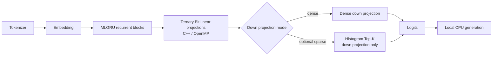

# Leviathan 1.58-bit Engine

[](https://github.com/ShiningSon/Leviathan-1.58bit-Engine/actions/workflows/ci.yml)
[](LICENSE)

Leviathan is an experimental local CPU inference stack for native ternary / 1.58-bit recurrent language models. It combines a custom C++/OpenMP BitLinear runtime, an attention-free MLGRU path, packed ternary weights, and optional histogram Top-K activation sparsity. The project has measured proof-model scaling from 30M through the v09a 200M-class model, which has approximately 233.4M estimated trainable parameters.

> **Project status:** research prototype. The current v09a 200M-class local CPU candidate uses histogram Top-K `0.10` on the down projection. In repeat-30 interleaved testing it reached **175.33 ms / 97.54 tok/s** versus dense **193.92 ms / 88.30 tok/s**, with both modes at **600/600 strict QA**. This is an experimental result on one local CPU, not a general sparse speedup claim. Leviathan proof models are not general assistants.

The current 200M-class package is published at [ShiningSon/Leviathan-MLGRU-200M-TinyStories-Instruct-v09a](https://huggingface.co/ShiningSon/Leviathan-MLGRU-200M-TinyStories-Instruct-v09a). Its verified public revision, file sizes, and SHA-256 hashes are recorded in [`releases/v0.9.0_hf_manifest.json`](releases/v0.9.0_hf_manifest.json).

Release: [Leviathan v0.9.0](https://github.com/ShiningSon/Leviathan-1.58bit-Engine/releases/tag/v0.9.0)

## 60-second quickstart

Requirements: Python, PyTorch, a C++ compiler with OpenMP support, and the dependencies in `requirements.txt`. On Windows, install the MSVC Build Tools used by PyTorch C++ extensions.

```bash
python -m pip install -r requirements.txt
hf download ShiningSon/Leviathan-MLGRU-200M-TinyStories-Instruct-v09a --local-dir leviathan_mlgru_200m_instruct_v09a
```

Run the current experimental 200M-class sparse candidate from the repository root:

```bash
python engine.py --bin leviathan_mlgru_200m_instruct_v09a/leviathan_mlgru_200m_instruct_v09a.bin --meta leviathan_mlgru_200m_instruct_v09a/leviathan_mlgru_200m_instruct_v09a_meta.json --architecture mlgru --prompt-template qa --max-new 80 --top-k 0.10 --sparse-scope down --sparse-min-density 0.6 --no-top-k-sort --top-k-select histogram
```

For a dense baseline, replace the sparse flags with `--top-k 0`. The first run may compile the C++ extension. Use `--prompt-template qa` for the instruct proof models; `plain` is only for raw continuation experiments.

## Why Leviathan is different

- **Native ternary path:** the runtime targets models trained for ternary weights instead of applying generic post-training quantization to arbitrary FP16 checkpoints.
- **Local CPU runtime:** packed 2-bit ternary weights are consumed by custom C++/OpenMP BitLinear kernels with AVX2 and portable scalar paths.
- **Attention-free recurrence:** MLGRU updates recurrent state step by step and does not build attention maps.
- **Projection-scoped sparsity:** histogram Top-K can be restricted to the FFN down projection while recurrent and state projections stay dense.
- **Quality-guarded measurement:** the benchmark uses expected terms, forbidden terms, maximum word counts, warmups, repeats, and interleaved mode scheduling.

## Architecture overview



Linear weights use row-major 2-bit ternary packing. Structural tensors such as embeddings, normalization weights, and recurrent parameters are stored separately in the Leviathan package metadata and binary payload.

## Confirmed scaling results

The compact source of truth is [`benchmarks/results/scaling_summary.json`](benchmarks/results/scaling_summary.json). [`BENCHMARK.md`](BENCHMARK.md) retains the detailed and historical experiment record.

| Model | Dense | Recommended Top-K | Selector / scope | Sparse result | Strict QA | Tok/s delta | Latency delta | Status |
|---|---:|---:|---|---:|---:|---:|---:|---|
| 30M v02g route | 50.74 ms / 350.97 tok/s | `0.12` | histogram / down | 50.25 ms / 354.17 tok/s | 950/1000 both | +0.91% | -0.97% | Experimental local CPU candidate; small margin |
| 70M v07b | 72.85 ms / 238.50 tok/s | `0.08` | histogram / down | 68.54 ms / 254.12 tok/s | 600/600 both | +6.55% | -5.92% | Experimental local CPU candidate |
| 100M v08a | 101.15 ms / 176.73 tok/s | `0.06` | histogram / down | 90.39 ms / 191.14 tok/s | 570/600 -> 600/600 | +8.15% | -10.64% | Experimental local CPU candidate |
| 200M-class v09a | 193.92 ms / 88.30 tok/s | `0.10` | histogram / down | 175.33 ms / 97.54 tok/s | 600/600 both | +10.46% | -9.58% | Current experimental local CPU candidate |

All rows are model-specific local CPU observations. They do not establish that Top-K is always faster, that the same density is optimal elsewhere, or that the result automatically transfers to other CPUs or larger models. Top-K `0.08` was faster on v09a but is not recommended because strict QA dropped to 570/600.

Validate the compact summary without model weights:

```bash
python scripts/validate_benchmark_summary.py
```

## Model zoo

Published Leviathan runtime packages:

- [30M v02g](https://huggingface.co/ShiningSon/Leviathan-MLGRU-30M-TinyStories-Instruct-v02g): published QA proof package; dense is the stable default.
- [70M v07b](https://huggingface.co/ShiningSon/Leviathan-MLGRU-70M-TinyStories-Instruct-v07b): published 70M experimental package; Top-K `0.08` candidate.
- [100M v08a](https://huggingface.co/ShiningSon/Leviathan-MLGRU-100M-TinyStories-Instruct-v08a): published 100M experimental package; Top-K `0.06` candidate.
- [200M-class v09a](https://huggingface.co/ShiningSon/Leviathan-MLGRU-200M-TinyStories-Instruct-v09a): published current package with approximately 233.4M estimated trainable parameters; Top-K `0.10` candidate.

See [`MODEL_ZOO.md`](MODEL_ZOO.md) for package status, runtime compatibility, historical experiments, and model-specific caveats.

## Reproducing the benchmark

The confirmed v09a comparison used 20 strict QA prompts, 30 measured repeats, one warmup per mode, and an interleaved schedule. After downloading the package, run from the repository root:

```bash
python scripts/benchmark_engine.py --model-dir ./leviathan_mlgru_200m_instruct_v09a --engine ./engine.py --prompts ./benchmarks/prompts_v02b_qa.json --architecture mlgru --prompt-template qa --max-new 80 --modes 0 0.08 0.10 0.12 --repeat 30 --sparse-min-density 0.6 --no-top-k-sort --sparse-scope down --top-k-select histogram --mode-schedule interleave --out-dir ./benchmark_runs/v09a_200m_histogram_candidates_repeat30
```

The runner writes `results.json`, `results.md`, and `sample_outputs.txt` under the selected `benchmark_runs/` directory. These are local review artifacts and are intentionally ignored by Git. CPU model, compiler, thread scheduling, background load, and thermal state can change the result; reproduce the method, not an assumed identical number.

Full protocol: [`docs/REPRODUCIBILITY.md`](docs/REPRODUCIBILITY.md). Runner details: [`docs/BENCHMARK_AUTOMATION.md`](docs/BENCHMARK_AUTOMATION.md).

## Training and export

Training scripts under `training/` run the MLGRU proof route on Modal, apply fake ternary/QAT-style linear weights and fake INT8 activations, and export packed Leviathan v2 packages. The v09a H100/H200 paths and exact configs are documented in [`docs/V09A_200M_SCALING_PROBE.md`](docs/V09A_200M_SCALING_PROBE.md).

The package boundary is intentional:

- **GitHub:** source, benchmark definitions, configs, tests, cards, and documentation.
- **Hugging Face:** model binary, metadata, tokenizer, report, sample outputs, and model card.

Never treat a Leviathan package as a standard Transformers checkpoint. It must be run through `engine.py`.

## Limitations

- This is a research runtime and proof-model collection, not a general assistant product.
- Results come from one documented Windows CPU environment and are not a broad hardware study.
- The strict QA set has only 20 project-specific prompts; it is a regression guard, not a comprehensive language-model evaluation.
- TinyStories training leaves narrow domain behavior and occasional story-style continuation in early proof models.
- Histogram Top-K, `--no-top-k-sort`, and projection-scoped sparsity are experimental. Dense remains the stable default for the 30M package.
- Threshold sparsity and naive block Top-K were negative experiments and are not part of the active runtime path.
- The first local run compiles a PyTorch C++ extension and requires a compatible compiler/OpenMP toolchain.

## Repository structure

```text
.
|-- engine.py                         # C++/OpenMP ternary CPU and MLGRU runtime
|-- quantizer.py                      # Leviathan package quantizer/export helper
|-- benchmarks/
|   |-- prompts_v02b_qa.json          # 20-prompt strict QA regression set
|   `-- results/scaling_summary.json  # canonical compact scaling summary
|-- scripts/
|   |-- benchmark_engine.py           # repeatable local benchmark runner
|   |-- validate_benchmark_summary.py # summary consistency validator
|   |-- check_release_readiness.py    # repository release checks
|   `-- publish_hf_package.py         # authenticated HF package uploader
|-- training/
|   |-- configs/                      # versioned training configurations
|   `-- *.py                          # Modal training and export paths
|-- tests/                            # standard-library, weight-free tests
|-- docs/                             # experiment, reproducibility, and release notes
|-- hf_cards/                         # versioned Hugging Face model cards
|-- releases/                         # compact verified release manifests
|-- MODEL_ZOO.md
|-- BENCHMARK.md
|-- CONTRIBUTING.md
|-- CITATION.cff
`-- LICENSE
```

## Roadmap

### v0.9 research artifact

- [x] Train and export the v09a 200M-class MLGRU proof model.
- [x] Confirm repeat-30 interleaved dense and histogram Top-K results.
- [x] Publish the v09a Leviathan runtime package on Hugging Face.
- [x] Add a canonical benchmark summary, release checks, lightweight tests, and cross-platform CI.
- [ ] Validate the candidate on additional CPU hardware.
- [ ] Expand strict QA beyond the 20-prompt project regression set.
- [x] Create the `v0.9.0` tag and GitHub Release after final review.

### Toward v1.0

- [ ] Improve sparse-kernel throughput and reduce Top-K selection overhead further.
- [ ] Add broader quality and hardware evaluation.
- [ ] Define stable package/runtime compatibility guarantees.
- [ ] Promote an API or CLI surface only after compatibility and reproducibility criteria are stable.

## Contributing and citation

Read [`CONTRIBUTING.md`](CONTRIBUTING.md) before proposing runtime or benchmark changes. The repository includes [`CITATION.cff`](CITATION.cff) for research citation metadata, [`docs/V09_RELEASE_NOTES.md`](docs/V09_RELEASE_NOTES.md) for the v0.9 artifact summary, and [`docs/V09_RELEASE_CHECKLIST.md`](docs/V09_RELEASE_CHECKLIST.md) for the final release gates.

## License

Released under the [MIT License](LICENSE).
